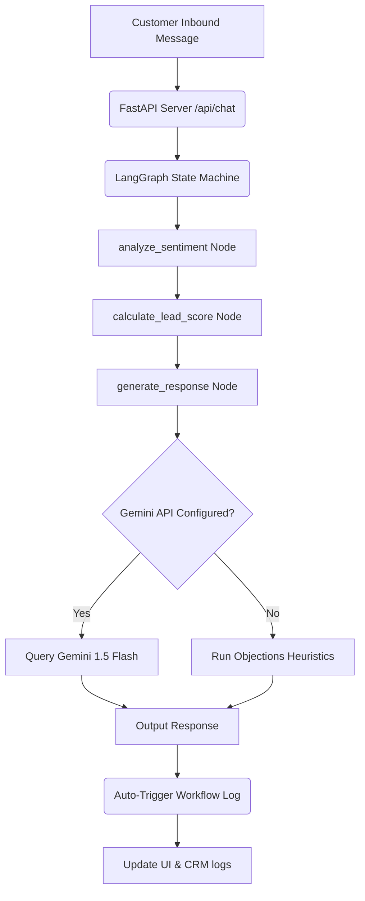

# Comprehensive Project Implementation Plan: FlowPilot AI

FlowPilot AI is a state-of-the-art, autonomous, AI-powered revenue operations and sales automation platform designed to prevent lead drop-offs, optimize objection handling, and recover lost pipeline. This document outlines the complete architectural design, technology stack, features set, and code structures of the project.

---

## 🛠️ Technology Stack & Architecture

FlowPilot AI is built as a modular monorepo containing a modern React frontend and an asynchronous Python backend linked via REST APIs.



### 1. Backend Layer (FastAPI & LangGraph)
- **FastAPI**: Serves high-performance asynchronous REST endpoints on port `8000` with CORS support for development. Handles lead storage, chat routing, analytics metrics computation, and background tasks execution.
- **LangGraph**: Orchestrates a stateful multi-agent decision-making loop. Keeps track of the agent state shape (`AgentState` dict) across consecutive conversational turns.
- **Google Gemini 1.5 Flash**: Connected via the official `google-generativeai` SDK to evaluate message intents, analyze sentiments, and generate professional, sales-oriented objection handling copy.
- **Heuristics Objections Engine**: Serves as an offline fallback when the API key is not configured, parsing keywords (e.g. SAM SSO, price, budget, schedule demo, cancel) to respond dynamically.

### 2. Frontend Layer (Next.js 16 & React 19)
- **Next.js 16 (App Router)**: Orchestrates page layout, rendering, and routing under port `3000`. Fully typed with strict TypeScript and compiled with Webpack/Turbopack.
- **State Management**: Syncs real-time lead changes and audit logs with port 8000 via polling hooks, falling back to fully functional offline mock state controllers to prevent demo crashes.
- **Styling System**: Vanilla CSS modules paired with global CSS variables to implement a high-end glassmorphic theme inspired by ElevenLabs, featuring neon accents, custom radial chart paths, and smooth micro-animations.

---

## ⚡ Complete Feature Capabilities

FlowPilot AI operates as a virtual SDR (Sales Development Representative) that continuously handles customer communications, updates CRM records, runs diagnostics, and executes automated pipeline recovery.

### 1. Core Conversational Intelligence
*   **Stateful Memory Retention**: The LangGraph state machine maintains absolute memory of historical client threads, allowing the AI to keep context (e.g., team size, product interests) consistent across long conversations.
*   **Contextual Objection Handling**: Utilizes Gemini 1.5 Flash to automatically interpret complex, conversational buying blockers (such as security compliance inquiries, pricing constraints, or competitor comparisons) and formulate warm, empathetic, and persuasive responses.
*   **Heuristic Fallback Systems**: In the event of Gemini API limits or offline local operation, a keyword heuristic router automatically intercepts standard questions (like SAML SSO support, startup discounts, demo bookings) to provide instant, correct responses.

### 2. Real-Time Customer Diagnostics
*   **Sentiment Classification**: Continuously monitors buyer sentiment, classifying incoming messages into one of four states:
    *   `Excited`: Positive buyer signals, expressing high interest or scheduling requests.
    *   `Hesitant`: Pricing, budgeting, or comparison reservations.
    *   `Urgent`: Tight timelines, ready to buy, onboarding specifications.
    *   `Frustrated`: Frustration with pricing, integration, or general client distress.
*   **Dynamic Lead Scorer**: Automatically scores each lead from 0 to 100 based on positive/negative intent cues:
    *   `SSO/SAML/Security` triggers: **+10 score**
    *   `Buy/Onboarding/Invoice` triggers: **+15 score**
    *   `Demo/Meeting/Call` triggers: **+8 score**
    *   `Expensive/Cost/Budget` triggers: **-5 score**
    *   `Cancel/Frustrated/Terrible` triggers: **-15 score**
*   **Conversion Probability Indicator**: Computes a dynamic conversion rate projection (from 0.05 to 0.99) based on the lead score weighted by sentiment multipliers:
    *   `Urgent` modifier: **x1.15**
    *   `Excited` modifier: **x1.10**
    *   `Hesitant` modifier: **x0.85**
    *   `Frustrated` modifier: **x0.50**
*   **Churn Risk Profiler**: Dynamically updates risk metrics:
    *   `High`: Set instantly if sentiment is *Frustrated*.
    *   `Medium`: Set if lead score drops below 40, or sentiment is *Hesitant*.
    *   `Low`: Standard safe state.

### 3. CRM Automation & Summarization
*   **AI Sales summarizer**: After every client reply, FlowPilot uses Gemini to digest the full chat log history and generate a concise, 1-sentence sales summary (under 20 words) updating the lead profile in real-time.
*   **CRM Webhook Integration**: Simulates instant synchronization with HubSpot or Salesforce APIs, returning logged payloads of changes synced directly to corporate CRM systems.

### 4. Revenue Operations Automation Engine
*   **Inactive Re-engagement (wf-1)**: Scans lead inactivity thresholds. If a prospect is silent for over 48 hours, it automatically:
    *   Adjusts lead status to "recovered"
    *   Updates sentiment to "Satisfaction"
    *   Drafts and sends a custom early-bird discount offer (15% off) directly in the thread
    *   Increments workflow run counters and creates an entry in the audit logs
*   **Hot Lead Route & Alert (wf-2)**: Instantly detects when a lead score reaches 80+. Auto-routes lead ownership, triggers Slack notifications for the sales channel, and logs a successful alert dispatch.
*   **Frustration Escalation Node (wf-3)**: If a client's message triggers a *Frustrated* sentiment rating, FlowPilot immediately:
    *   Pauses the autonomous AI replying loop (flagged in client logs) to prevent automated copy errors.
    *   Alerts support channels on Slack with context (last customer message, client email, pipeline value).
    *   Routes a manual task to the support directory queue.

### 5. Sales Command Center Panel
*   **KPI Diagnostics Grid**: Real-time stats counting total pipeline value ($), recovered revenue ($), conversion probability average, and active lead fractions.
*   **Operations CLI Console**: A live mock terminal confirming LangGraph compilation flows, rest port states, and Gemini model link status.
*   **Conversational Sandbox UI**: A double-pane monitor allowing administrators to read leads profiles, manually send custom chat messages to test backend responses, and simulate objections.
*   **Custom SVG Diagnostics Charts**:
    *   **Sentiment Donut Chart**: Renders a glowing radial graph detailing the percentage distribution of customer sentiments.
    *   **Milestone Area Chart**: Plotted dynamically to track historical pipeline recovery milestones (SSO, applied discounts, recovered revenue).

---

## 📂 Project Directory Structure

```
FlowPilot AI/
├── backend/
│   ├── app/
│   │   ├── agents/
│   │   │   └── graph.py       # LangGraph multi-agent compile & prompt setup
│   │   ├── lead_scoring/
│   │   │   └── scorer.py      # Sentiments, conversion probability, and risk scorers
│   │   ├── workflows/
│   │   │   └── engine.py      # Re-engagement, routing, and escalation engines
│   │   ├── memory/
│   │   │   └── store.py       # In-memory lead storage & logs persistence (data.json)
│   │   ├── analytics/
│   │   │   └── metrics.py     # KPI dashboard calculations
│   │   ├── integrations/
│   │   │   └── alerts.py      # Slack webhook payloads and server log prints
│   │   ├── crm/
│   │   │   └── sync.py        # HubSpot/Salesforce mock sync & AI summaries
│   │   └── main.py            # FastAPI REST endpoints & routes definitions
│   ├── .env.example           # Configurations template
│   └── requirements.txt       # Python backend packages
│
├── frontend/
│   ├── src/
│   │   ├── app/
│   │   │   ├── dashboard/
│   │   │   │   └── page.tsx   # Operations Command Center layout
│   │   │   ├── page.tsx       # ElevenLabs-style Landing page & Login Modal
│   │   │   ├── landing.module.css # Landing page css modules
│   │   │   ├── page.module.css   # Dashboard css modules
│   │   │   └── globals.css    # Custom dark styling tokens & animations
│   │   ├── components/
│   │   │   ├── Sidebar.tsx    # Left navigation sidebar
│   │   │   └── PitchDeckTab.tsx # Architecture pitch presentation tab
│   │   ├── dashboard/
│   │   │   └── OverviewTab.tsx # Overview command dashboard tab
│   │   ├── conversations/
│   │   │   └── ConversationsTab.tsx # Sandbox live monitor tab
│   │   ├── workflows/
│   │   │   └── WorkflowsTab.tsx # Automation workflows rules tab
│   │   ├── analytics/
│   │   │   └── AnalyticsTab.tsx # Pipeline diagnostics charts tab
│   │   └── types.ts           # Unified TypeScript interfaces
│   ├── next.config.ts         # Next.js configurations
│   ├── package.json           # Frontend packages
│   └── tsconfig.json          # TypeScript configurations
│
├── start-dev.bat              # Batch script launching dev server in separate windows
└── .gitignore                 # Root-level ignore configuration
```

---

## 🏁 Hackathon Presentation Script (Pitch Checklist)

When presenting to judges, follow this checklist to guarantee maximum evaluation points:

1. **The Hook (Default Homepage)**: Start on the landing homepage. Briefly outline the problem (lost pipeline due to slow follow-ups) and explain how FlowPilot solves it.
2. **Interactive Live Playplay**: Use the Objection Handling Sandbox on the landing page. Click **Security / SSO** and **Pricing Objection** to show how the AI handles complex inquiries instantly.
3. **The Escalation Pitch**: Click **Frustrated Escalation**. Show that the AI stops replying instantly and routes to human support.
4. **Login Transition**: Open the login modal, use the pre-filled admin credentials, and sign in.
5. **Dashboard Command Center**:
   - Show the **Overview tab** and describe the Diagnostic CLI output confirming the stable LangGraph server and Gemini status.
   - Show the **Analytics tab** highlighting the custom SVG sentiment charts.
   - Show the **Workflows tab** to explain how rules automate email dispatching and Slack routing. Show the logged escalation event in the **Audit Logs**.
6. **Architecture Deck**: Navigate to the **Pitch & Arch** tab to walk the judges through the state variables and the production scaling roadmap.
